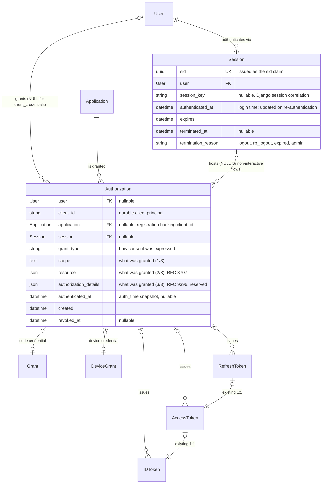

# ADR 0001: Authorization and Session entities in the token model

- **Status:** Draft — for discussion (revision 2, see *Revision log*)
- **Deciders:** django-oauth-toolkit maintainers
- **Date:** 2026-07-05; revised 2026-10-02
- **Related:** #1723 (discussion), #1545 (OIDC Back-Channel Logout,
  milestone 3.4.0)

## Motivation

DOT is increasingly deployed as an identity provider, and a cluster of
long-standing problems blocks it from doing that job correctly. Each has
been reported or worked around individually; this ADR argues they share a
root cause and should be fixed structurally rather than symptom by symptom.

**Logout is wrong, and modern logout is impossible.**

- RP-initiated logout cannot scope revocation to the session being ended:
  logging out of one website in one browser deletes the user's tokens for
  *every* application on *every* device, while the user's login in other
  browsers survives untouched.
- OIDC Back-Channel Logout (#1545) and Front-Channel Logout cannot be
  implemented: both require a `sid` claim identifying the authentication
  session, and DOT has no session to identify.

**Security-relevant spec gaps.**

- RFC 6749 §4.1.2 and RFC 9700 (OAuth Security BCP) call for revoking all
  tokens issued on a replayed authorization code. DOT deletes the code at
  exchange, so a replayed code is indistinguishable from a random one and
  the tokens it minted cannot be found.
- Refresh-token reuse detection leans on `token_family`, a bookkeeping
  field that approximates lineage for one flow only.
- `auth_time` is asserted from `user.last_login`, which is user-global:
  logging in on a phone silently refreshes the authentication freshness
  claimed to RPs in a laptop's session, undermining `max_age`.

**Consent is not a first-class fact.**

- Whether a user has authorized an application is inferred from whether an
  unexpired access token happens to exist. Consent is forgotten when tokens
  expire and remembered only as long as tokens live.
- There is no way to show a user which applications they have authorized,
  revoke one application's access as a unit, or audit which tokens resulted
  from which act of consent.

**Root cause.** The token tables are the only durable state, so every
feature that needs a longer-lived concept ends up anchored to whichever
token lives longest — in practice the refresh token acting as a stand-in
for both "the user's consent" and "the user's session." Both stand-ins are
wrong: consent spans token chains, and sessions span applications while
legitimately *not* spanning `offline_access` tokens. The fix is to model
the two missing concepts — the granted authorization and the
authentication session — and hang the existing token chain off them.

## Summary

Introduce two new swappable models that reify concepts DOT currently leaves
implicit:

1. **`Authorization`** — a durable record of one authorization event: *user
   U (or client C alone) authorized client A for scopes S on resources R at
   time T via grant type G*. Created by **every** flow that issues tokens.
   Tokens and flow-specific credentials (authorization code, device code)
   reference it. It is the lineage anchor for a token chain; remembered
   consent across events is a separate, later concern built on top of it.
2. **`Session`** — the OP authentication session: *user U is logged in on
   user agent UA*. Identified by a UUID `sid` issued in ID tokens, correlated
   with (but distinct from) the Django session. Interactive `Authorization`s
   reference it.

These are orthogonal axes over the existing token chain. `Authorization`
answers *"which act of consent produced these tokens"*; `Session` answers
*"who is logged in, where"*. They are never merged, and revoking one is not
the same operation as ending the other.

## Context

### What DOT records today

- **`Grant` models one kind of authorization grant — the code — and nothing
  durable.** The name is spec-accurate for the code flow (RFC 6749 §1.3.1:
  the authorization code *is* the grant credential), but the other flows'
  grant credentials, and the granted consent they all represent, are not
  modeled. The row is created only in `_create_authorization_code()`
  (auth-code and hybrid flows) and **deleted** at token exchange by
  `invalidate_authorization_code()`. Nothing can reference it after the
  ~60 seconds it lives.
- **`DeviceGrant` is a second flow-specific credential table** (the
  `device_code`), not unified with `Grant`.
- **Implicit, Resource Owner Password Credentials (ROPC), and
  client_credentials leave no record** of the authorization at all.
- **No token carries lineage.** DOT cannot answer "which tokens were issued
  under which authorization." Consequences:
  - RFC 6749 §4.1.2 (and RFC 9700 §4.5) say a replayed authorization code
    SHOULD revoke all tokens previously issued on it. Because the code row
    is deleted, a replayed code is indistinguishable from an unknown code
    and the revocation is unimplementable.
  - `RefreshToken.token_family` exists solely to approximate lineage for
    rotation-reuse detection, and only within one refresh chain.
- **Consent memory is an access-token scan.** `AuthorizationView` with
  `require_approval="auto"` skips the consent screen iff an *unexpired
  access token* for user×application covers the requested scopes. Consent is
  remembered exactly as long as the newest access token lives. The check
  compares **scopes only**: tokens and codes already carry an RFC 8707
  `resource` list, but `allow_scopes()` ignores it, so a user who approved
  `read` for resource A is silently auto-approved for `read` on resource B.
  That is a bug in the current code independent of this ADR; it is noted
  here because the coverage rule below must not reproduce it.
- **There is no session model.** The OP session is the Django session,
  anonymously. Nothing in the token model references it and it has no
  identifier that could appear in a token. Consequences:
  - No `sid` claim in ID tokens, so OIDC Front-Channel and Back-Channel
    Logout (#1545) are unimplementable in their session-scoped form.
  - RP-initiated logout cannot scope revocation to "the session the
    `id_token_hint` belongs to," so `do_logout()` deletes **all** of the
    user's tokens across all applications and devices, while Django sessions
    in *other* browsers survive. Over-broad and under-broad at once.
  - `auth_time` in ID tokens is taken from `user.last_login`, which is
    user-global: logging in on a phone silently refreshes the `auth_time`
    asserted to RPs in a laptop's session, which breaks `max_age`
    semantics.

### What the specs say

- **RFC 6749 §1.3** defines an *authorization grant* as "a credential
  representing the resource owner's authorization … used by the client to
  obtain an access token." Every flow has one: the code, the user's
  password (ROPC), the client's own credentials, the device code (RFC 8628
  is titled "Device Authorization Grant"), assertions (RFC 7521/7523), and
  the refresh token acting as the grant at the token endpoint. DOT's `Grant`
  and `DeviceGrant` models reify two of these credentials, correctly named;
  the remaining flows' grants — and the durable consent that every grant
  credential represents — have no model.
- **No OAuth RFC defines a durable consent record.** It is deliberately out
  of scope, and every mature implementation invented it independently:
  Keycloak `UserConsent`, Ory Hydra consent sessions, Okta's Grants API.
  `Authorization` is DOT's version of that entity.
- **OIDC Front-/Back-Channel Logout** define a *session* as the continuous
  period during which an End-User is authenticated at the OP **via a
  particular user agent**, identified by the `sid` claim. It is created at
  login (not at authorization), spans all RPs the user signs into during
  that browser session, and its lifetime is decoupled from token lifetime
  in both directions — `offline_access` refresh tokens are *defined* as
  tokens that outlive it, and implicit/`id_token`-only responses produce
  sessions with no refresh token at all.
- Mature OPs converge on the same two-level structure: Keycloak
  `UserSession` → `AuthenticatedClientSession` → tokens; Hydra login session
  (`sid`) → consent → tokens; IdentityServer server-side session → client
  participation list → grants.

## Decision

### Target entity-relationship model

Three tiers plus one orthogonal axis:

| Tier | Models | Lifetime | Role |
|---|---|---|---|
| Credential | `Grant` (auth code), `DeviceGrant` (device code) | seconds–minutes | RFC 6749 "authorization grant" credentials, flow-specific |
| Authorization | `Authorization` (new) | until revoked / retention limit | record of one authorization event; token lineage anchor |
| Tokens | `AccessToken`, `RefreshToken`, `IDToken` | as configured | unchanged |
| Session axis | `Session` (new) | login → logout/expiry | OP authentication session per user agent; `sid` |

### `Authorization` (new swappable model)

Fields: `id`, `user` (FK, **nullable**), `client_id` (the durable client
principal, stored as a value), `application` (FK, **nullable**, `SET_NULL`:
the registration backing `client_id`, if any), `session` (FK, **nullable**),
`grant_type`, **what was granted** as three columns — `scope`, `resource`
(RFC 8707 list, same field type as on the token tables) and
`authorization_details` (RFC 9396, reserved: nothing writes or enforces it
yet) — `authenticated_at` (nullable snapshot, see *Session*), `created`,
`updated`, `revoked_at` (nullable).

**What was granted is a triple, not a scope string.** Scopes alone do not
identify a permission once the same scope value applies to several APIs:
`read` for resource A is not `read` for resource B (RFC 8707 §2.1). DOT
already narrows tokens by `resource` at the code and token endpoints, so an
`Authorization` that recorded only `scope` would be *less* precise than the
tokens issued under it. `authorization_details` is reserved for the same
reason: RAR describes "what was granted" alongside scope, and adding the
column now avoids a second migration of every downstream table when RAR
lands.

**Coverage rule.** An `Authorization` *covers* a request iff:

1. the requested scopes are a subset of the granted scopes;
2. the requested resources are a subset of the granted resources, where an
   empty resource list is a distinct value ("unrestricted audience"), not a
   wildcard — so a resource-less request is covered only by a resource-less
   grant, and a resource-restricted request is never covered by a grant for
   a different resource set; and
3. the request carries no `authorization_details`. RFC 9396 defines no
   generic subset relation between details objects (comparison is
   type-specific), so until a per-type comparison exists a RAR request is
   never auto-covered and always prompts.

This rule is the only definition of "already authorized" in the codebase:
`require_approval="auto"`, the future consent surface, and tests all use
it. Nothing in Phase 1 switches callers to it yet (see *Consent*).

Creation — one hook per flow:

| Flow | When an `Authorization` is created | `user` | `session` |
|---|---|---|---|
| Authorization code / hybrid | at approval in `AuthorizationView`; the `Grant` (code) row carries the FK and hands it to tokens at exchange | set | set |
| Implicit | at approval in `AuthorizationView` (same UI); tokens FK it directly — note implicit never creates a `Grant` row, which is why lineage cannot hang off the code table | set | set |
| Device (RFC 8628) | at user approval on the verification page; `DeviceGrant` FKs it | set | set (the verification-page browser session) |
| ROPC | at token issuance — one per password login; each is a distinct authorization event | set | NULL |
| client_credentials | `get_or_create` **one per application** with `user=NULL`; the consent is the client registration itself, and M2M clients requesting tokens in a loop must not mint a row per request | NULL | NULL |
| Refresh token grant | **never** — refreshed tokens inherit the parent `Authorization`, matching the RFC semantics of refresh as re-presentation of the original grant | — | — |

What this replaces or fixes:

- **Token lineage / replay revocation.** `Grant` gains `exchanged_at`
  (nullable) and is **no longer deleted** at exchange;
  `invalidate_authorization_code()` stamps it instead. A code presented
  twice is now detectable, and revocation cascades through its
  `Authorization` to all descendant tokens (RFC 6749 §4.1.2, RFC 9700).
- **`token_family` is subsumed** for all flows — a rotation family is
  exactly "refresh tokens under one `Authorization`," including ROPC where
  no code exists. The field is retained and deprecated; reuse-detection
  logic can migrate to the FK.
- **Consent memory becomes possible.** `Authorization` records what was
  granted precisely enough that remembered consent *can* be derived from it
  instead of from live access tokens. The switch itself is deferred — see
  *Authorization is a lineage record, not the consent ledger* below.

### Authorization is a lineage record, not the consent ledger

One `Authorization` is created per authorization *event*. That is the right
boundary for lineage: replay revocation, rotation-reuse detection and
`cleartokens` all operate on exactly one token chain. It is the wrong
boundary for "has this user authorized this application": events end for
reasons that have nothing to do with the user withdrawing permission, and
withdrawing permission must reach every event, not one. The two are kept
apart as follows.

`revoked_at` means **"this chain may no longer mint or refresh tokens."**
It is set by:

- authorization-code replay (RFC 6749 §4.1.2 / RFC 9700 §4.5);
- refresh-token reuse detection (`REFRESH_TOKEN_REUSE_PROTECTION`);
- an explicit revoke — RFC 7009 of a refresh token, the admin action, or a
  future revoke-by-application.

It is **not** set by:

- session termination (logout). Terminating a `Session` revokes the
  session's non-`offline_access` token chains, but leaves their
  `Authorization` rows unrevoked: logging out is not withdrawing consent,
  and a user who logs back in must not be re-prompted for every
  application. The rows become *dormant* (no live tokens, not revoked) and
  are reaped by `cleartokens` after the retention window.
- token expiry. An expired chain is dormant, not revoked.

**Remembered consent is deferred, not derived.** Deriving "current consent"
as the union of unrevoked `Authorization` rows was considered (open
question 2) and rejected: a dormant row would keep auto-approving forever,
a security-triggered revocation would silently withdraw consent, and there
is no row on which a user *narrowing* their consent could be recorded. The
right shape is a separate consent record per (user × client) carrying the
granted triple and a `withdrawn_at`, with revoke-by-application defined as
*withdraw consent and revoke every active `Authorization` under it*. Its
schema is **not** decided here: it needs the coverage rule above to be
exercised against real RAR and multi-resource deployments first.

Consequently `require_approval="auto"` **keeps scanning access tokens in
Phase 1.** It changes in two steps, each behind a setting:

1. apply the full coverage rule (scopes *and* resources) to the existing
   access-token scan — a bug fix that needs no new model;
2. consult the consent record once it exists.

### `Session` (new swappable model)

Fields: `id`, `sid` (UUID, unique, default `uuid4`), `user` (FK),
`session_key` (nullable, indexed), `authenticated_at`, `created`, `updated`,
`expires`, `terminated_at` (nullable), `termination_reason` (choices).

Semantics and plumbing:

- **The row is minted lazily; the authentication time is not.** The
  `Session` row is created at the first authorization request after login:
  generate a UUID, persist the row, store the `sid` in `request.session`,
  reuse for subsequent authorizations in the same browser session. Plumbed
  from the view (which has `request.session`) into the validator via the
  existing `OAuthLibCore._get_extra_credentials()` hook — no oauthlib
  changes needed. The row's creation time is *not* the login time and must
  never stand in for it: minutes or days can pass between login and the
  first authorization request. `authenticated_at` is sourced, in order,
  from:
  1. a `user_logged_in` receiver that records `now()` in the Django session
     at the moment Django authenticates the user — this covers every
     backend that calls `django.contrib.auth.login()`, including the
     RemoteUser, SAML and CAS integrations in common use;
  2. a pluggable hook (a validator method, settable like the other
     validator overrides) for deployments whose authoritative session lives
     upstream — Shibboleth, CAS, PingFederate — so the OP can assert the
     *upstream* authentication instant (and later a stable upstream session
     reference) rather than the moment the Django session was established;
  3. `user.last_login`, **only** for Django sessions that predate deployment
     of this feature or were created by a backend that bypasses `login()`.
     This is the status quo and is documented as degraded.
- **Re-authentication updates the session, authorizations keep their
  snapshot.** When the user authenticates again inside a live OP session
  (`prompt=login`, a future `max_age` check, or simply logging in again),
  the `sid` is kept — RPs that already hold it must still be reachable by
  session-scoped logout — and `Session.authenticated_at` is **updated** to
  the new instant. Every `Authorization` records `authenticated_at` as a
  **snapshot** of the session's value at the time consent was given, and
  ID tokens take `auth_time` from the `Authorization`, never from the live
  `Session`. This is what makes refresh correct: OIDC Core §12.2 requires
  that an ID token issued on refresh carry the time of the *original*
  authentication, not of a later re-authentication, and a shared mutable
  session field cannot satisfy that for authorizations granted before the
  re-authentication. Note that Django's `login()` keeps session data when
  the same user re-authenticates (it cycles the key, it does not flush), so
  the implementation must detect a login timestamp newer than the stored
  `Session.authenticated_at` and update the row rather than reuse it
  unchanged.
- **The Django `session_key` is not the `sid`.** The session key is the auth
  cookie value (secret, must not appear in an ID token) and rotates at
  login. The `sid` is a distinct UUID stored *in* the session; `session_key`
  is kept only as an optional correlation aid (e.g. terminating the OP
  session when the Django session is destroyed).
- **A DB row, not just session state**, because back-channel logout must
  answer "which RPs participated in this session" *after* the Django session
  is gone, and cache-backed session stores are not queryable.
- **ID tokens carry the `sid` claim**; `auth_time` moves from
  `user.last_login` to `Authorization.authenticated_at` (the snapshot of
  `Session.authenticated_at` described above), fixing the parallel-login
  `max_age` bug without breaking §12.2 on refresh.
- RP participation in a session is **derived** (`distinct` over the
  session's `Authorization`s / ID tokens); no per-(session × application)
  join table until back-channel delivery/retry state forces one.

### Logout and revocation semantics

Stated explicitly because it is the pair most at risk of being conflated:

- **Revoking an `Authorization`** kills its token chains on every device.
  It does not log anyone out.
- **Terminating a `Session`** logs the user agent out: it ends the Django
  session, revokes the session's token chains **except** those with
  `offline_access`, and (once implemented) notifies participating RPs via
  back-channel logout. It does not touch the user's other browsers, other
  sessions, or offline grants, and it does **not** revoke the
  `Authorization` rows (see *Authorization is a lineage record*).

RP-initiated logout becomes `id_token_hint → sid → terminate that session`,
behind a setting; the current revoke-everything behavior remains the default
until a deprecation cycle completes.

### Nullability is semantic, not transitional

All new FKs are nullable **permanently**: client_credentials and ROPC tokens
have a session-less existence; client_credentials has a user-less one;
`offline_access` refresh tokens legitimately outlive their session;
`Authorization.application` is NULL when the client has no provisioned
registration (deleted, or derived as with CIMD) while `client_id` keeps the
row attributable; and pre-migration rows have no history to backfill (they
are treated as authorization-less and session-less; `sub`-only back-channel
logout still covers them). NULL means "this axis does not apply."

### Naming

The existing `Grant` model is **not renamed**. `OAUTH2_PROVIDER_GRANT_MODEL`
and downstream subclasses make a rename a gratuitous break, and "grant" for
the code table is the most literal RFC 6749 reading — the code *is* the
grant credential for that flow. The new entities are `Authorization` and
`Session` (both swappable, `OAUTH2_PROVIDER_AUTHORIZATION_MODEL` /
`OAUTH2_PROVIDER_SESSION_MODEL`), with docs clarifying the distinction.

### Deletion semantics

Deletion is not a domain action for either new entity — `revoke()` (consent
axis) and `terminate()` (session axis) are. The schema enforces this rather
than relying on convention:

- **Token FKs to `Authorization` are `on_delete=RESTRICT`**: an
  authorization cannot be deleted while tokens issued under it exist,
  *except* through a cascade that is deleting those tokens too (this is why
  `RESTRICT`, not `PROTECT`: Django permits a `RESTRICT` reference when the
  referring rows are themselves collected by `CASCADE` in the same
  deletion). Deleting a user therefore still works — the tokens cascade
  from the user and the restriction is satisfied — and so would deleting an
  application with `CASCADE` on both `Authorization.application` and the
  tokens' `application` FKs. The choice of `SET_NULL` for
  `Authorization.application` is therefore a **history-preservation policy**
  (a deleted registration must not erase the record of consent attributed
  to its `client_id`), not a workaround for a deletion that would otherwise
  fail. `SET_NULL` on the token FKs would let a raw `.delete()` silently
  orphan tokens and erase the lineage this ADR exists to create; `CASCADE`
  would erase the revoked-refresh-token trail that rotation-reuse detection
  (`REFRESH_TOKEN_REUSE_PROTECTION`) depends on, making "revoke by delete" a
  security regression.
- **`Grant.authorization` is `CASCADE`**: a code is only a claim ticket on
  its consent record and must not remain exchangeable without it.
  `DeviceGrant.authorization` stays `SET_NULL` — the device row predates the
  authorization and carries independent audit state (`DENIED`, timestamps).
- **`Authorization.session` is `SET_NULL`**: authorizations legitimately
  outlive sessions (`offline_access`), so `RESTRICT` here would block
  session cleanup indefinitely; a nulled pointer means "the session is over
  and has been purged."
- **`revoke()` also closes outstanding credentials**: unexchanged codes are
  deleted and approved-but-unredeemed device grants are denied, so a revoked
  consent cannot mint new tokens; `validate_code` rejects codes whose
  authorization is inactive as a race guard.
- **The admin exposes the domain actions, not deletion**: "Revoke selected
  authorizations" / "Terminate selected sessions" actions, all fields
  read-only, add and delete disabled.

### Cleanup

`cleartokens` purges rows only once nothing depends on them, which the
`RESTRICT` constraint independently guarantees for authorizations: revoked
and dormant `Authorization`s are deleted once every token issued under them
is gone and the retention window has passed, and
ended (terminated or expired) `Session`s are deleted once no authorization
references them — so the `sid` linkage survives exactly as long as the
authorizations granted during the session do. Retention windows are
settings.

## Alternatives considered

- **Refresh token as the session anchor (status quo de facto).** Rejected:
  flows without refresh tokens still create sessions; `offline_access`
  refresh tokens must outlive the session by definition; one session spans
  many refresh tokens across RPs; the `sid` must be minted into the ID token
  at authentication time while refresh token identity rotates and never
  appears in ID tokens.
- **A persistent `Grant` as the session anchor.** Rejected: a grant is per
  (user × client); a session is per (user × user agent) and spans clients.
  Grant-scoped logout both misses the session's other RPs and kills the
  same RP's other-device grants. Grants and sessions also have independent
  lifetimes (`offline_access`).
- **Two-tier model: persist `Grant` and hang tokens off it (no
  `Authorization`).** Rejected after review: implicit flow issues tokens
  with no code row, ROPC/client_credentials have no code at all, and the
  device code lives in a different table — lineage anchored on the code
  credential covers only some flows. Reifying the abstract concept covers
  all of them uniformly and lets `session` live in exactly one place
  instead of being denormalized onto every token table.
- **Using the Django session key as the `sid`.** Rejected: it is the auth
  cookie value (secret), rotates at login, and cache-backed session stores
  cannot be enumerated at logout time.
- **Implementing OIDC Session Management 1.0 (`check_session_iframe`).**
  Out of scope: effectively dead due to third-party cookie blocking.
  Back-channel logout is the future-proof mechanism; front-channel is an
  optional cheap extra.

## Consequences

### Positive

- RFC 6749 §4.1.2 / RFC 9700 code-replay revocation becomes implementable.
- #1545 back-channel logout becomes implementable (`sid` + participation
  lookup); front-channel logout becomes possible.
- RP-initiated logout can be correctly scoped to one session.
- Consent memory *can* be decoupled from access-token lifetime once the
  consent record lands; "authorized apps" UI and revoke-by-app have a
  precise definition of "what was granted" (scope × resource × details) to
  build on.
- Correct per-session `auth_time` / `max_age` semantics, including on
  refresh (§12.2).
- `token_family` unified under a first-class concept for all flows.

### Negative / risks

- Two new swappable models and new FKs on the abstract token bases: every
  downstream project with concrete custom models eats a `makemigrations`
  cycle. Mitigation: land **all** schema in one release wave (nullable,
  inert additions), even though the features ship across releases.
- `Grant` rows persist after exchange: table growth, handled by
  `cleartokens`; deployments with custom `invalidate_authorization_code`
  overrides keep working but silently lose replay detection (docs note).
- One extra row write per interactive authorization and per ROPC login.
- `authenticated_at` quality depends on the login path: deployments whose
  backend bypasses `login()` and do not implement the upstream hook keep
  today's `last_login` behaviour, and the docs must say so.
- Scope-creep risk: `Authorization` will tempt session-ish behavior (e.g.
  scoping logout by authorization "since the FK exists"). The logout
  semantics section above is the line to hold in review.

## Implementation sequencing

- **Phase 0 — this ADR.** Agree the entities, FKs, nullability, and
  semantics above. Phases 1 and 2 are independent once this is fixed.
- **Phase 1 — `Authorization` as the issuance record.** New model (with
  `client_id`, `scope`, `resource`, `authorization_details`,
  `authenticated_at` all in the schema from the start) + per-flow creation
  hooks; `Grant.exchanged_at` replaces delete-on-exchange; token and
  credential FKs; replay-triggered revocation; `cleartokens`. **No change to
  `require_approval="auto"`.** Pure OAuth value, no OIDC concepts, and it
  exercises the swappable-model migration machinery on the axis that
  carries no new semantics. `authenticated_at` is populated from today's
  source (`last_login`) until Phase 2 supplies a better one.
- **Phase 1b — coverage rule.** Apply the scope × resource coverage rule to
  the existing access-token auto-approval, behind a setting, with the
  RAR-never-auto-covered clause. Independent of the new models; fixes the
  current bug; can ship in any release.
- **Phase 2 — `Session`.** New model, lazy row minting, `user_logged_in`
  capture of the authentication time, the upstream-authority hook,
  re-authentication handling, `sid` claim, `session` FK on `Authorization`,
  `Authorization.authenticated_at` snapshot from the session, `auth_time`
  from the snapshot. Additive; no behavior change for deployments that do
  not opt in to the hook.
- **Phase 3 — payoff features.** Session-scoped RP-initiated logout behind
  a setting; back-channel logout (#1545); `offline_access` survival policy;
  optional front-channel logout.
- **Phase 4 — consent record.** Separate (user × client) consent state with
  `withdrawn_at`, revoke-by-application, "authorized apps" surface, and the
  switch of `require_approval="auto"` to consult it. Designed in its own
  ADR once Phases 1–2 have run in production.

Schema packaging: prefer landing Phase 1 + 2 migrations in a single release
to halve downstream migration churn, even if Phase 2/3 features ship later.

## Open questions

1. **client_credentials granularity** — one `Authorization` per application,
   or per (application × scope set)? Per-application with a scope superset
   is proposed above; per-scope-set gives cleaner audit at the cost of row
   churn.
2. **Consent presentation** — *Resolved: derivation is not enough.*
   Per-event `Authorization` rows stay as the lineage record; remembered
   consent gets its own (user × client) record in Phase 4, for the reasons
   in *Authorization is a lineage record, not the consent ledger*.
3. **Does terminating a Django session terminate the OP `Session`?**
   *Resolved: yes, in Phase 2.* Django sends ``user_logged_out`` before
   ``logout()`` flushes the session, so a signal receiver can still read the
   ``sid`` from the Django session and terminate the OP `Session`
   (``reason="logout"``). Already-terminated sessions are left untouched, so
   RP-initiated logout (Phase 3) can record its own reason first; the same
   receiver is where back-channel logout dispatch will hang.
4. **Retention defaults** for terminated `Session`s and revoked
   `Authorization`s before `cleartokens` purges them.
5. **`require_approval="auto"` switch** — *Resolved: deferred.* Phase 1b
   fixes the coverage rule on the existing token scan; the switch to the
   consent record is Phase 4, behind a setting.
6. **Resource coverage for resource-less grants** — the rule above treats
   "no resource" as a distinct value. Should a deployment be able to opt
   into "a resource-less grant covers any resource" for backwards
   compatibility with how tokens behaved before RFC 8707 support?
7. **Upstream-authority hook shape** — a validator method returning
   `(authenticated_at, upstream_session_reference | None)` is proposed; is
   the upstream reference wanted on `Session` now (nullable column) or in
   a later migration?
8. **Re-authentication of a different user in the same browser** — Django
   flushes the session, so the old `sid` is lost client-side while its
   `Session` row stays live. Should the `user_logged_in` receiver terminate
   the previous user's OP session (`reason="superseded"`)?

## Revision log

**Revision 2 (2026-10-02)** — incorporates the external design review
posted on #1723. Each point was checked against the code before being
adopted.

- **Consent coverage needs the resource as well as the scope** (accepted).
  `Authorization` gains `resource` (and keeps the reserved
  `authorization_details`); a coverage rule is defined over the triple.
  Verified: `Grant`, `AccessToken` and `RefreshToken` carry a `resource`
  list today and the token endpoint narrows by it, while
  `require_approval="auto"` compares scopes only.
- **Lazy session creation does not establish the authentication time**
  (accepted). The source of `authenticated_at` is now specified: a
  `user_logged_in` receiver, an upstream-authority hook, and `last_login`
  only as a documented fallback. Re-authentication semantics are defined
  (same `sid`, session time updated, per-authorization snapshot) so
  refreshed ID tokens satisfy OIDC Core §12.2.
- **Separate remembered consent from the lifecycle of one token chain**
  (accepted). `Authorization` is explicitly the issuance/lineage record;
  what sets and does not set `revoked_at` is enumerated; session
  termination no longer touches it; the consent record and the
  auto-approval switch move to a later phase. Open questions 2 and 5 are
  resolved accordingly.
- **Correct the deletion argument** (accepted; applies to the companion
  *entity-model revision* document). Its §6 claimed that `CASCADE` on
  `Authorization.application` plus `RESTRICT` on token→`Authorization`
  makes `Application.delete()` fail. It does not: Django's collector
  allows a `RESTRICT` reference whose referring rows are collected by
  `CASCADE` in the same deletion, and the tokens' `application` FKs are
  `CASCADE`. Reproduced on Django 5.2 with a three-model fixture. The
  `client_id`-as-principal proposal stands on its own grounds (RFC 9068's
  mandatory `client_id` claim, CIMD/federation clients, the server survey);
  the *Deletion semantics* section above now states the `SET_NULL` choice
  as a history-preservation policy rather than as a fix for a failing
  delete.
- **Update the lifetime rationale against current code** (accepted; applies
  to the companion document §12 and the lifetime comments on #1723).
  `validate_refresh_token` now enforces `REFRESH_TOKEN_EXPIRE_SECONDS` at
  validation time, sliding from the paired access token's `expires`;
  enforcement no longer depends on `cleartokens` running. What remains for
  this ADR is unchanged: there is no *absolute* lifetime (rotation slides
  the window indefinitely), no per-token lifetime, and no reaper for
  abandoned chains, and the enforcement relies on a paired access token
  existing. `Authorization.created` / `Session` remain the anchors for
  those.
