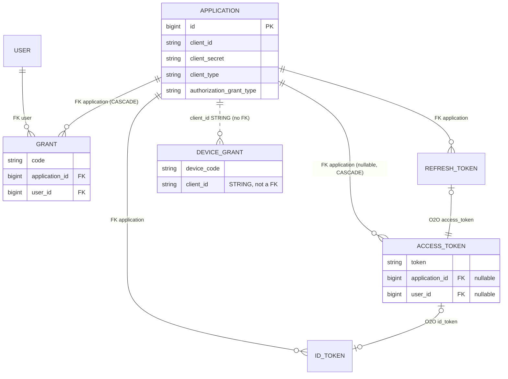
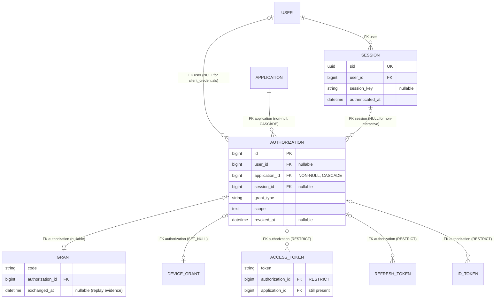
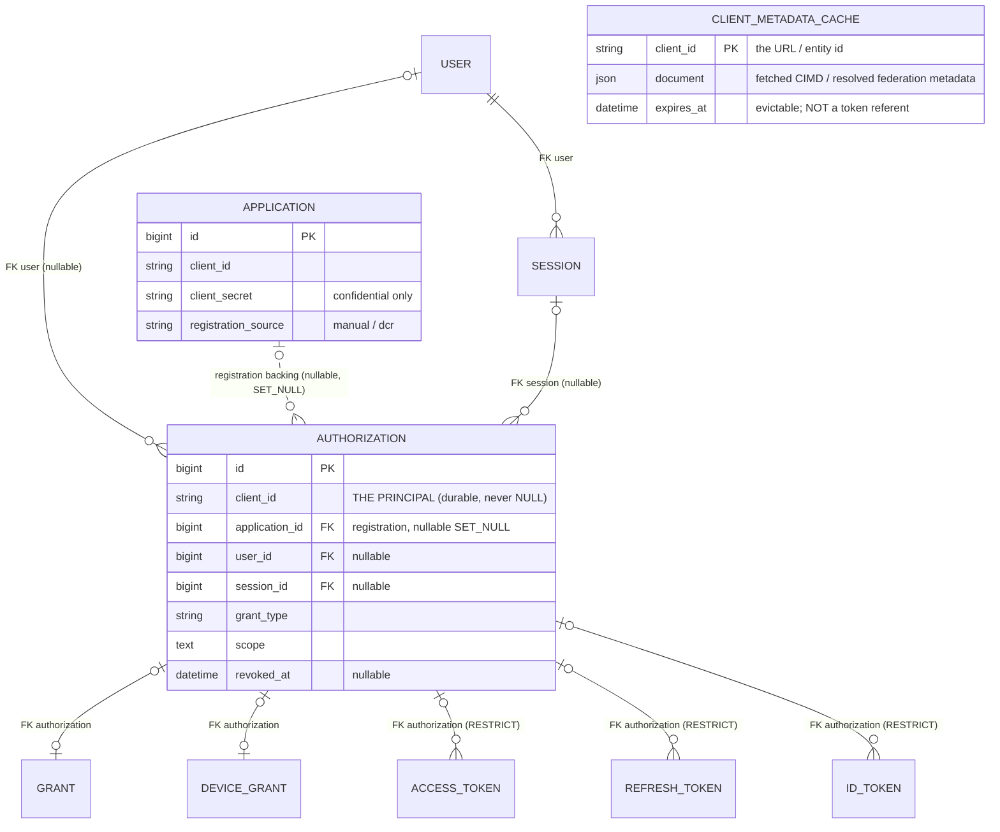
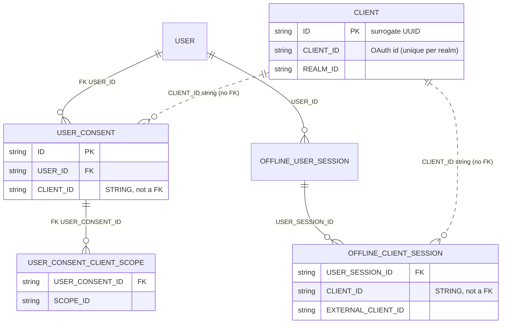
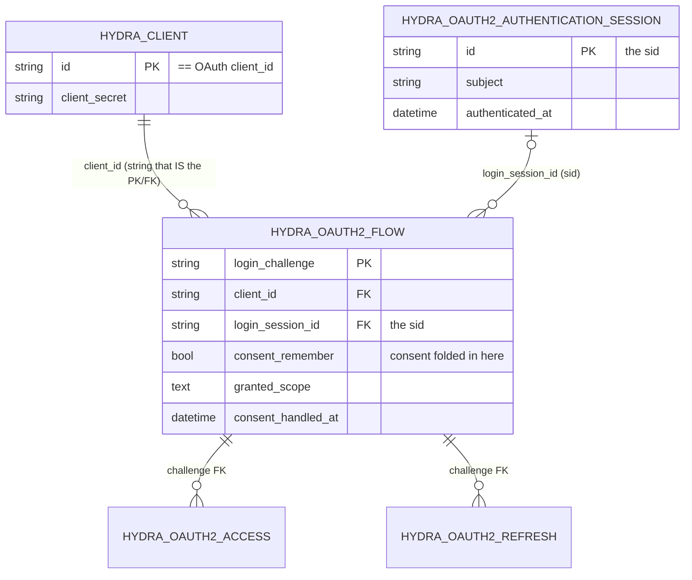
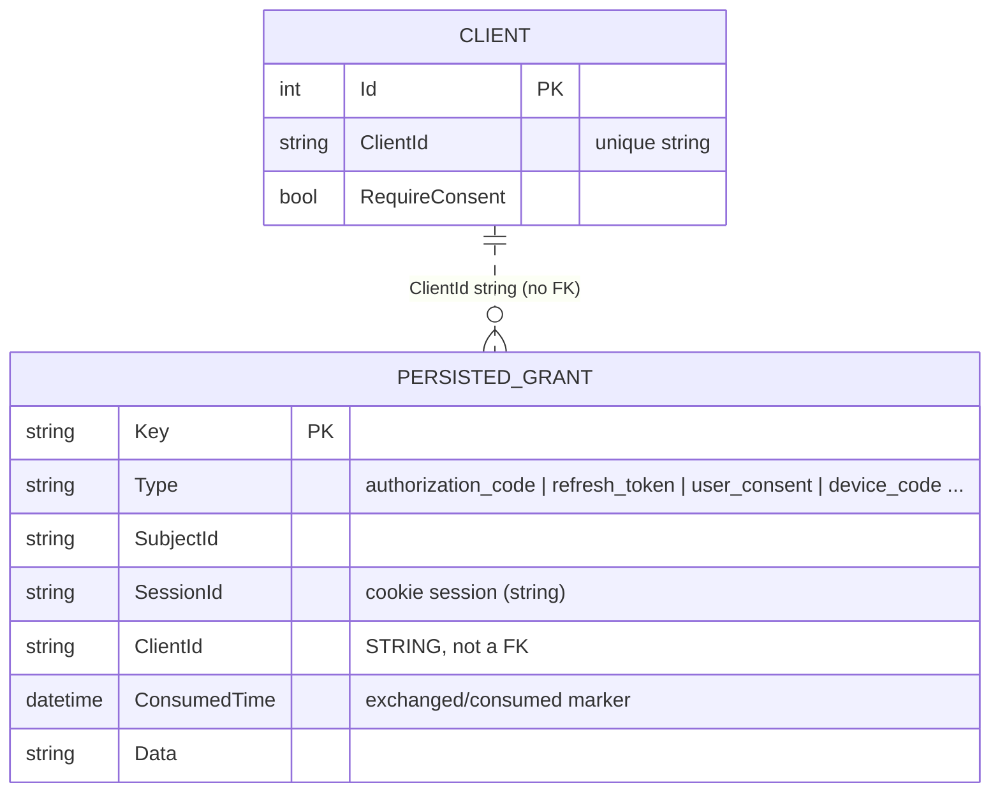
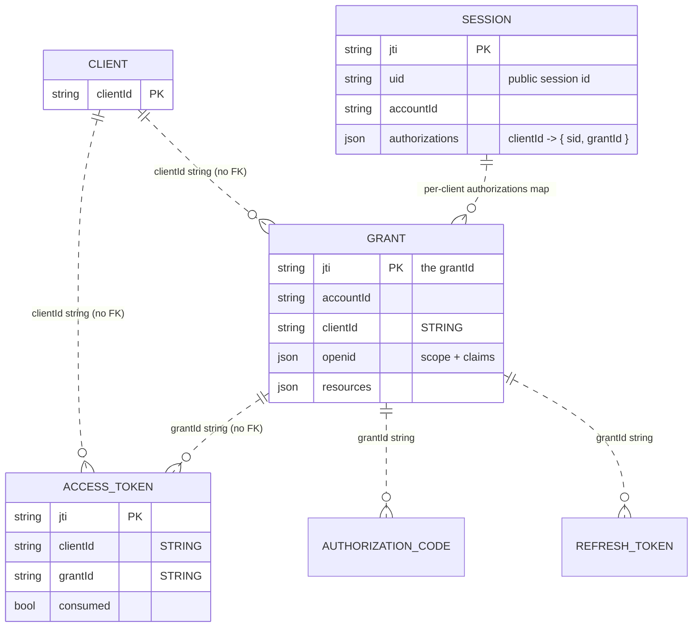
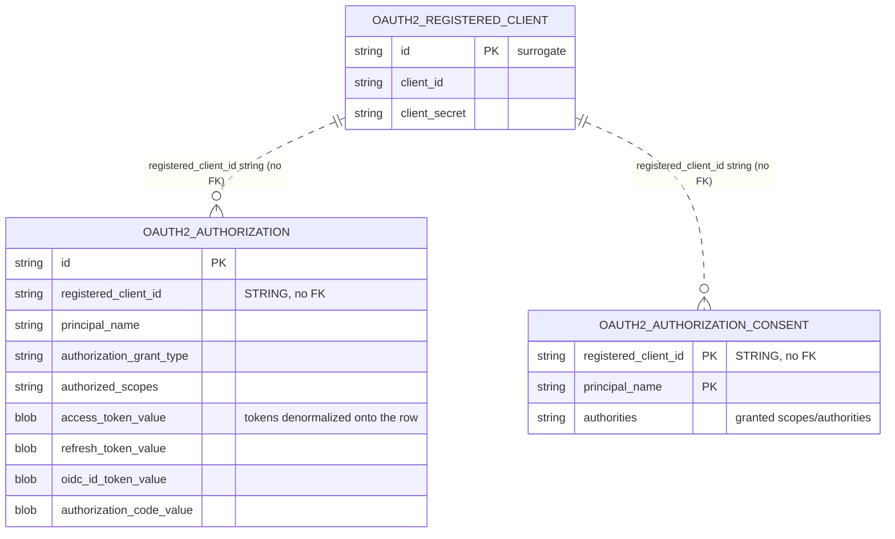
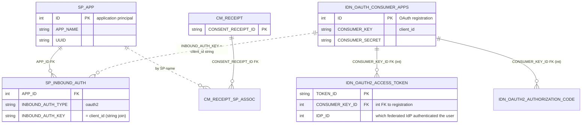

# ADR 0001 — ERDs for visual comparison

Companion to `0001-entity-model-revision.md`. One entity-relationship diagram per model
so the modelling choices can be compared side by side. Diagrams are **scoped to the
relevant entities** (client / registration / consent-authorization / session / tokens +
flow credentials) — they are not full schemas. Attribute lists show only the fields that
carry the argument.

All diagrams render on GitHub and in most Mermaid-aware viewers.

### Legend (read this first)

- **Solid line ( `||--o{` )** = an **enforced database foreign key**.
- **Dashed line ( `||..o{` )** = a **soft reference by identifier string** — the record
  stores the client's `client_id` (or equivalent) as a plain column with **no DB FK** to
  the client row.

The single most important thing to look for: **how does a durable record (consent / token
/ grant) point at the client — a solid line (FK to a registration row) or a dashed line
(a `client_id` string)?** That is the whole thesis of the revision.

The source basis for every diagram is the code review recorded in Grounding B of
`0001-entity-model-revision.md`.

---

## 1. DOT — current (master)

Everything points at `APPLICATION` by a hard FK. There is **no consent entity and no
session entity**. The lone dashed line is the device flow, which already references its
client by a `client_id` **string** (`DeviceGrant.client_id`).

**Modelling note.** Client identity == a row in the swappable `APPLICATION` table, and
durable client attribution lives *only* in that FK. There is nowhere else the "who" is
recorded — which is why an introspected token (`application = NULL`) is attributable to no
client at all, and why CIMD must mint a row to have anything to point at.

---

## 2. DOT — ADR 0001 target (Authorization + Session)

Adds the two entities the ADR argues for. `AUTHORIZATION` is the durable consent + lineage
anchor; `SESSION` is the OP authentication session (`sid`). Tokens and flow credentials now
hang off `AUTHORIZATION`. **The client is still a hard FK on `AUTHORIZATION`.**

**Modelling note & the §6 inconsistency, drawn out.** Follow the two red lines:
`APPLICATION ||--o{ AUTHORIZATION` is **CASCADE**, but `AUTHORIZATION |o--o{ ACCESS_TOKEN`
is **RESTRICT**. So deleting an `APPLICATION` with live tokens cascades into its
`AUTHORIZATION`, which `RESTRICT` then blocks — the delete fails. The graph cannot
simultaneously "preserve token history on client deletion" (the ADR's stated goal) and
keep these two `on_delete`s.

---

## 3. DOT — proposed Model 4 (client_id on Authorization; registration optional)

The change: `AUTHORIZATION` carries **`client_id` (a string) as the durable principal**;
the `APPLICATION` link becomes an **optional `SET_NULL`** pointer to "the provisioned
registration, if any." Derived-client metadata (CIMD/federation) is an **evictable cache
keyed by `client_id`, never a token referent** (shown detached, because nothing points at
it). Tokens attribute to the client through `AUTHORIZATION.client_id`, which never goes
NULL.

**Modelling note.** `client_id` on `AUTHORIZATION` is the load-bearing move. A NULL
`application_id` now means "derived / ephemeral / deleted client" *without losing the
identity*. `CLIENT_METADATA_CACHE` is deliberately unconnected: it is looked up by
`client_id` when rendering consent / validating redirect URIs, but no durable record
foreign-keys it, so evicting it (or a flood of attacker URLs) touches no token. This is
DOT's current `APPLICATION` FK graph moved onto the string-attribution pattern the six
servers below already use.

---

## 4. Keycloak

Client has a **surrogate UUID PK (`ID`) distinct from `CLIENT_ID`**. Consent
(`USER_CONSENT`) FK-joins the **user** but references the **client by string**. Sessions
are **two-level**: `USER_SESSION` → `AUTHENTICATED/OFFLINE_CLIENT_SESSION`, the per-client
session also keyed by a `CLIENT_ID` string.

**Modelling note.** First-class consent table; client referenced by string; two-level
session. Note the client even has an internal identity (`ID`) separate from its OAuth
identifier (`CLIENT_ID`) — a mild principal/registration separation of its own.

---

## 5. Ory Hydra

The one outlier on both axes. Consent is **not a separate table** — it is remembered on
the `hydra_oauth2_flow` row. The client is referenced by a `client_id` string that is
**also an enforced FK** (`hydra_client.id` *is* the `client_id`).

**Modelling note.** Durable consent = a *remembered flow row*, not its own entity. Client
reference is a string that happens to be FK-enforced. Session (`sid`) is a first-class
single-level login session.

---

## 6. IdentityServer4 / Duende

A **single unified grant store** (`PersistedGrant`) holds authorization codes, refresh /
reference tokens **and user consent**, differentiated only by a `Type` string. The client
is a `ClientId` **string** column — **no FK** to the `Client` config entity (whose PK is
an `int Id`). `ConsumedTime` is the exchanged/consumed marker.

**Modelling note.** Consent is just a `PersistedGrant` of `Type = "user_consent"`, keyed
by subject+client. No server-side session table in IS4 (the ASP.NET cookie; a `SessionId`
string ties grants to it). Everything client-side is a string.

---

## 7. node-oidc-provider (panva)

A first-class `Grant` **is** the durable consent record; tokens point at it by a `grantId`
**string** and at the client by a `clientId` **string**. `Session` is separate, keyed by
`jti`, with a public `uid` and a **per-client** `authorizations[clientId] -> {sid, grantId}`
map.

**Modelling note.** The cleanest match to the proposal's shape: a durable `Grant`
(≈ `Authorization`), a separate `Session`, and everything referenced by string ids
(`clientId`, `grantId`) with a `consumed` marker on the credential.

---

## 8. Spring Authorization Server

The aggregate entity is **literally named `OAuth2Authorization`** and references the client
by a `registered_client_id` **string with no FK** in the DDL. Consent is a separate
first-class table `OAuth2AuthorizationConsent`, keyed by **(registered_client_id,
principal_name)**. All token types are **denormalized onto the single authorization row**.

**Modelling note.** Independent confirmation of the ADR's naming *and* the string-reference
pattern: an entity called `Authorization`, a standalone consent table, client-by-string,
no FK.

---

## 9. WSO2 Identity Server

The production instance of the **principal/registration split**. A protocol-agnostic
**Service Provider (`SP_APP`)** is the application identity; the OAuth **registration
(`IDN_OAUTH_CONSUMER_APPS`)** is one *inbound auth config* attached to it via
`SP_INBOUND_AUTH` — joined by the **`client_id` string** (`INBOUND_AUTH_KEY`). Tokens then
reference the *registration* by an **integer FK** (`CONSUMER_KEY_ID`). Consent is a
separate Kantara receipt (`CM_RECEIPT`).

**Modelling note.** Two separations at once: **application (`SP_APP`) vs OAuth registration
(`IDN_OAUTH_CONSUMER_APPS`)**, joined by a string; and tokens → registration by a hard FK.
This is Model 2's north star already shipping. (WSO2's "federation" is inbound identity
brokering + SSA-seeded DCR — `IDP_ID` on the token records which IdP authenticated the
*user* — not OpenID-Federation *client* establishment.)

---

## Cross-model summary

| Model | Consent/authorization entity | Client referenced from durable records by | Session |
|---|---|---|---|
| **DOT current** | none | **FK** to `Application` (+ string only in device flow) | none |
| **DOT ADR 0001** | `Authorization` | **FK** to `Application` | `Session` (sid) |
| **DOT Model 4 (proposed)** | `Authorization` (+ `client_id`) | **`client_id` string** (registration FK optional) | `Session` (sid) |
| Keycloak | `USER_CONSENT` | **string** (no FK) | two-level `USER_SESSION → CLIENT_SESSION` |
| Ory Hydra | *folded into flow row* | string **that is a FK** | login session (sid) |
| IdentityServer4 | `user_consent` PersistedGrant | **string** (no FK) | cookie (SessionId string) |
| node-oidc-provider | `Grant` | **string** (`clientId`/`grantId`) | `Session` (uid, per-client sid) |
| Spring Auth Server | `OAuth2AuthorizationConsent` | **string** (no FK) | Spring Security session |
| WSO2 | `CM_RECEIPT` | **FK** to registration; **string** to principal (`SP_APP`) | `IDN_AUTH_SESSION_STORE` |

Reading down the middle column: the durable client reference is a **string** in five of the
six OSS servers (Hydra's string is FK-enforced; WSO2 splits it — string to the principal,
FK to the registration). DOT is the only one that references the client purely by a hard FK
to the registration with no identifier string on the durable records — the coupling
Model 4 removes.
